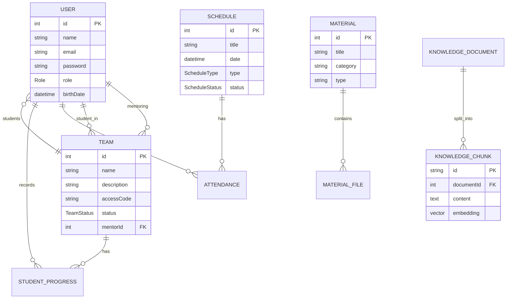

# Documentação do Banco de Dados — Tutoria Tech

Este documento descreve a estrutura do banco de dados do projeto Tutoria Tech, detalhando as entidades, relacionamentos, tipos de dados e a implementação de busca vetorial.

## 🛠️ Tecnologia
O projeto utiliza **PostgreSQL 16** com a extensão **pgvector** para suporte a embeddings de IA. O gerenciamento do esquema é feito através do **Prisma ORM**.

### Informações de Conexão (Desenvolvimento)
| Parâmetro | Valor |
| :--- | :--- |
| **Engine** | PostgreSQL 16 + pgvector |
| **Database** | `tutoriatech` |
| **User** | `tutoriatech_user` |
| **Password** | `tutoriatech_pass` |
| **Porta** | `5432` |

---

## 📊 Diagrama Entidade-Relacionamento (ER)

---

## 📝 Descrição das Tabelas

### 1. Usuários (`users`)
Armazena todos os participantes do sistema (Administradores, Mentoras e Alunas).
*   `id`: Identificador único (Autoincrement).
*   `name`: Nome completo.
*   `email`: E-mail único para login.
*   `password`: Hash da senha.
*   `role`: Papel no sistema (`ADMIN`, `MENTORA`, `ALUNA`).

### 2. Equipes (`teams`)
Grupos de alunas mentorados por uma voluntária.
*   `mentorId`: Relacionamento com a Mentora responsável.
*   `status`: Estágio atual do projeto (`IDEACAO`, `PROTOTIPAGEM`, etc.).
*   `accessCode`: Código para alunas entrarem na equipe.

### 3. Materiais (`materials` & `material_files`)
Repositório de conteúdo educativo.
*   Um `Material` pode ter múltiplos arquivos associados em `material_files`.
*   Os arquivos físicos são armazenados no **MinIO**.

### 4. Agenda e Presença (`schedules` & `attendances`)
Gestão de eventos e controle de participação.
*   `schedules`: Define a data, local e tipo do evento.
*   `attendances`: Tabela de junção que marca quais usuários compareceram a quais eventos.

### 5. Progresso das Alunas (`student_progress`)
Registros individuais de evolução técnica e comportamental.
*   Vincula uma aluna a uma equipe específica com notas e estágio de evolução.

### 6. IA e Conhecimento (`knowledge_documents` & `knowledge_chunks`)
Base de conhecimento para a assistente Rose.
*   `knowledge_documents`: Metadados dos documentos submetidos.
*   `knowledge_chunks`: Fragmentos de texto processados.
*   **Busca Vetorial**: A coluna `embedding` utiliza o tipo `vector(768)` do pgvector para permitir busca por similaridade de cosseno.

---

## 🔢 Enums (Tipos Enumerados)

| Enum | Valores |
| :--- | :--- |
| **Role** | `ADMIN`, `MENTORA`, `ALUNA` |
| **TeamStatus** | `IDEACAO`, `PROTOTIPAGEM`, `EM_DESENVOLVIMENTO`, `CONCLUIDO` |
| **ScheduleStatus** | `PENDENTE`, `REALIZADA`, `CANCELADA` |
| **ScheduleType** | `MENINAS_NO_LAB`, `RODA_DE_CONVERSA`, `SESSAO_DE_TUTORIA`, `TECHNOVATION_EVENT` |
| **ProgressStage** | `INICIO`, `DESENVOLVENDO`, `AVANCADO`, `CONCLUIDO` |

---

## 🚀 Configurações de Sistema (`system_settings`)
Tabela chave-valor para configurações dinâmicas, como:
*   `GEMINI_API_KEY`: Chave para os serviços de IA.
*   `ROSE_SYSTEM_PROMPT`: Instruções de comportamento da assistente Rose.

---

## 🔍 Opções Dinâmicas (`system_options`)
Permite configurar as opções de selects e labels do sistema sem alterar o código, agrupadas por categorias como categorias de materiais ou tipos de eventos.
