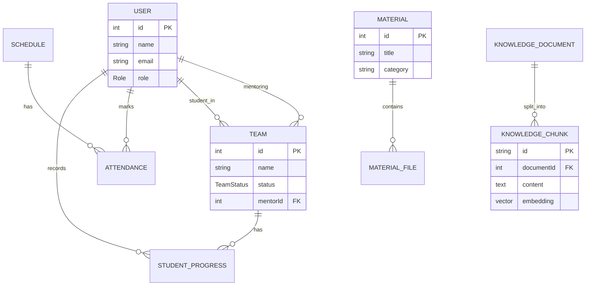

# 🗄️ Modelo de Dados — Banco de Dados

Este documento detalha a estrutura do banco de dados do **Tutoria Tech**, abrangendo entidades, relacionamentos, tipos enumerados e a implementação técnica da busca vetorial (RAG).

---

## 🏗️ Tecnologia e Infraestrutura

O sistema utiliza o **PostgreSQL 16** como motor principal, potencializado pela extensão **pgvector** para processamento de inteligência artificial.

| Componente | Especificação |
| :--- | :--- |
| **Engine** | PostgreSQL 16 |
| **Extensões** | `pgvector` (Busca Vetorial) |
| **ORM** | Prisma |
| **Database** | `tutoriatech` |
| **Acesso Local** | `localhost:5432` |

---

## 📊 Diagrama Entidade-Relacionamento (ER)

Abaixo, a representação visual das conexões entre as principais entidades do sistema.

---

## 📝 Descrição das Entidades

### 👥 Gestão de Usuários e Equipes
*   **Users (`users`)**: Centraliza todos os perfis do sistema. Distingue entre `ADMIN`, `MENTORA` e `ALUNA`.
*   **Teams (`teams`)**: Agrupamentos de alunas sob a supervisão de uma mentora. Possui um `accessCode` para entrada simplificada de alunas.
*   **Student Progress (`student_progress`)**: Acompanhamento individual da evolução técnica e comportamental de cada aluna dentro de sua equipe.

### 📚 Conteúdo e Conhecimento
*   **Materials (`materials`)**: Catálogo de conteúdos de apoio (PDFs, Vídeos, Guias).
*   **Material Files (`material_files`)**: Referências aos arquivos físicos armazenados no **MinIO**.
*   **Knowledge (`knowledge_documents` & `chunks`)**: Base de dados especializada para a **IA Rose**. O texto é fragmentado em *chunks* e convertido em vetores de 768 dimensões para busca por similaridade.

### 📅 Eventos e Presença
*   **Schedules (`schedules`)**: Registro de encontros, workshops e tutorias.
*   **Attendances (`attendances`)**: Controle de participação em tempo real, vinculando usuários aos eventos da agenda.

---

## 🔢 Tipos Enumerados (Enums)

Esses tipos garantem a integridade dos dados e padronizam os estados do sistema.

| Enum | Finalidade | Valores |
| :--- | :--- | :--- |
| **Role** | Níveis de acesso | `ADMIN`, `MENTORA`, `ALUNA` |
| **TeamStatus** | Ciclo de vida do projeto | `IDEACAO`, `PROTOTIPAGEM`, `EM_DESENVOLVIMENTO`, `CONCLUIDO` |
| **ScheduleStatus** | Estado do evento | `PENDENTE`, `REALIZADA`, `CANCELADA` |
| **ProgressStage** | Nível de evolução | `INICIO`, `DESENVOLVENDO`, `AVANCADO`, `CONCLUIDO` |

---

## ⚙️ Configurações e Logs
*   **System Settings (`system_settings`)**: Armazena chaves de API e prompts do sistema (IA).
*   **System Options (`system_options`)**: Define dinamicamente os labels e cores das categorias e status usados no sistema.
*   **Activity Logs (`activity_logs`)**: Trilha de auditoria das ações críticas realizadas na plataforma.
