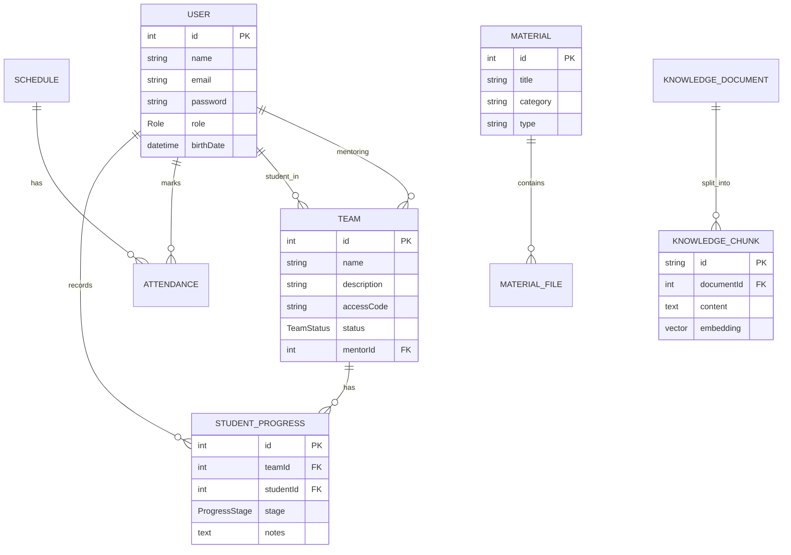

#  Modelo de Dados — Banco de Dados

Este documento detalha a estrutura do banco de dados do **Tutoria Tech**, abrangendo entidades, relacionamentos, tipos enumerados e a implementação técnica da busca vetorial (RAG).

---

##  Tecnologia e Infraestrutura

| Componente | Especificação |
| :--- | :--- |
| **Engine** | PostgreSQL 16 |
| **Extensões** | `pgvector` (Busca Vetorial) |
| **ORM** | Prisma |
| **Database** | `tutoriatech` |
| **Acesso Local** | `localhost:5432` |

---

##  Como Conectar (DBeaver / pgAdmin)

**Dados de Acesso:**
- **Host**: `localhost`
- **Porta**: `5432`
- **Banco de Dados**: `tutoriatech`
- **Usuário**: `tutoriatech_user`
- **Senha**: `tutoriatech_pass`
- **URL JDBC**: `jdbc:postgresql://localhost:5432/tutoriatech`

---

##  Diagrama Entidade-Relacionamento (ER)



---

##  Descrição das Entidades

###  Gestão de Usuários e Equipes

- **Users (`users`)**: Centraliza todos os perfis. Distingue entre `ADMIN`, `MENTORA` e `ALUNA`.
- **Teams (`teams`)**: Agrupamentos de alunas sob supervisão de uma mentora. Possui `accessCode` para auto-entrada de alunas via código.
- **Student Progress (`student_progress`)**: Acompanhamento individual da evolução de cada aluna dentro da equipe, com estágio e notas de feedback da mentora.

###  Conteúdo e Conhecimento

- **Materials (`materials`)**: Catálogo de conteúdos de apoio (PDFs, vídeos, guias).
- **Material Files (`material_files`)**: Referências aos arquivos físicos no **MinIO**.
- **Knowledge Documents (`knowledge_documents`)**: Documentos da base de conhecimento da Rose — podem ser arquivos (chave MinIO) ou URLs completas.
- **Knowledge Chunks (`knowledge_chunks`)**: Texto fragmentado com embeddings de 768 dimensões para busca semântica via pgvector.

###  Eventos e Presença

- **Schedules (`schedules`)**: Encontros, workshops e tutorias com 4 tipos e 3 estados.
- **Attendances (`attendances`)**: Controle de participação, vinculando usuários a eventos.

###  Configurações

- **System Settings (`system_settings`)**: Par chave-valor para `GEMINI_API_KEY` e `ROSE_SYSTEM_PROMPT`.
- **System Options (`system_options`)**: Opções dinâmicas de categorias e status usados no sistema, configuráveis pelo Admin. Pré-populadas pelo seed com 16 opções:
  - `MATERIAL_CATEGORY`: Programação, Design, Empreendedorismo, Desafios
  - `MATERIAL_TYPE`: Tutorial, Guia, Desafio, Template
  - `SCHEDULE_TYPE`: Meninas no Lab, Roda de Conversa, Sessão de Tutoria, Technovation Event
  - `TEAM_STATUS`: Ideação, Prototipagem, Em Desenvolvimento, Concluído
- **Activity Logs (`activity_logs`)**: Trilha de auditoria das ações críticas.

---

##  Tipos Enumerados (Enums)

| Enum | Finalidade | Valores |
| :--- | :--- | :--- |
| **Role** | Níveis de acesso | `ADMIN`, `MENTORA`, `ALUNA` |
| **TeamStatus** | Ciclo de vida do projeto | `IDEACAO`, `PROTOTIPAGEM`, `EM_DESENVOLVIMENTO`, `CONCLUIDO` |
| **ScheduleStatus** | Estado do evento | `PENDENTE`, `REALIZADA`, `CANCELADA` |
| **ScheduleType** | Tipo de encontro | `MENINAS_NO_LAB`, `RODA_DE_CONVERSA`, `SESSAO_DE_TUTORIA`, `TECHNOVATION_EVENT` |
| **ProgressStage** | Nível de evolução da aluna | `INICIO`, `DESENVOLVENDO`, `AVANCADO`, `CONCLUIDO` |

---

##  Busca Vetorial (pgvector)

Os `knowledge_chunks` armazenam embeddings de 768 dimensões gerados pelo modelo `gemini-embedding-2-preview`. A busca usa **similaridade cosseno**, retornando os 5 trechos mais relevantes para cada pergunta.

```sql
-- Exemplo de busca semântica usada pela Rose
SELECT content
FROM knowledge_chunks
ORDER BY embedding <=> query_embedding  -- operador cosseno pgvector
LIMIT 5;
```

Os documentos de conhecimento podem vir de:
- **Arquivos** (PDF, DOCX, TXT, MD, XLSX, CSV) — texto extraído diretamente
- **URLs** — texto extraído via requisição HTTP + BeautifulSoup (re-processável com "Atualizar")
